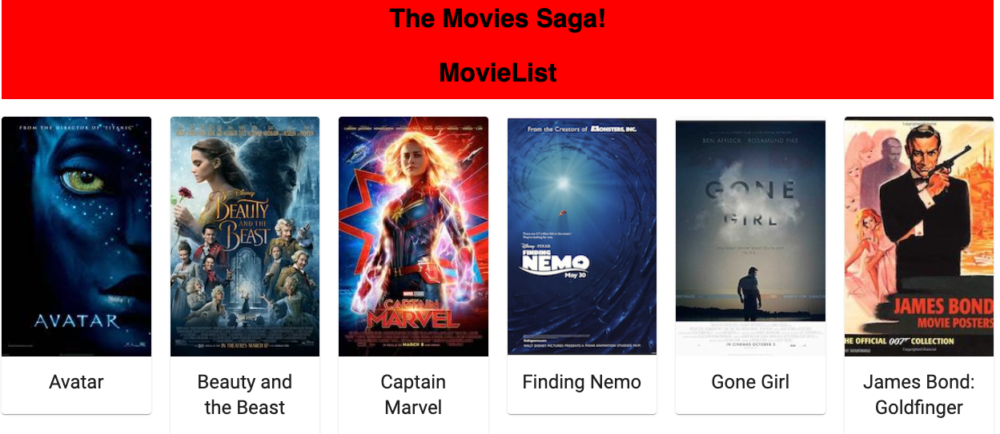

# Project Name
Movies Saga Project

## Description
This project took three days to develop.

I wanted to create an app that listed out a number of movies that could be clicked on to bring the user to another details page for that movie.

I was looking to use redux-sagas in order to pass information across the app and to grab the data necessary from multiple databases at once.

## Screen Shot 

### Prerequisites

- Node
- React
- Redux
- Redux-Sagas
- Axios
- Material UI
- PostgreSQL

## Installation

1. Create a database named `saga_movies_weekend`,
2. The queries in the `database.sql` file are set up to create all the necessary tables and populate the needed data to allow the application to run correctly. The project is built on [Postgres](https://www.postgresql.org/download/), so you will need to make sure to have that installed. I recommend using Postico to run those queries as that was used to create the queries, 
3. Open up your editor of choice and run an `npm install`
4. Run `npm run server` in your terminal
5. Run `npm run client` in your terminal
6. The `npm run client` command will open up a new browser tab for you!

## Usage

1. Click on any of the movie titles or posters
2. This will navigate you to the details of that movie
3. Click the return to list button to go back to the list of movie posters

## Built With

- Node
- React
- Redux
- Redux-Sagas
- Axios
- Material UI
- PostgreSQL

    
    
    
    
    
    
    
    
    
    
    
    

## Acknowledgement
Thanks to [Prime Digital Academy](www.primeacademy.io) who equipped and helped me to make this application a reality.

## Support
If you have suggestions or issues, please email me at [jeanlacosse@gmail.com](www.google.com)
